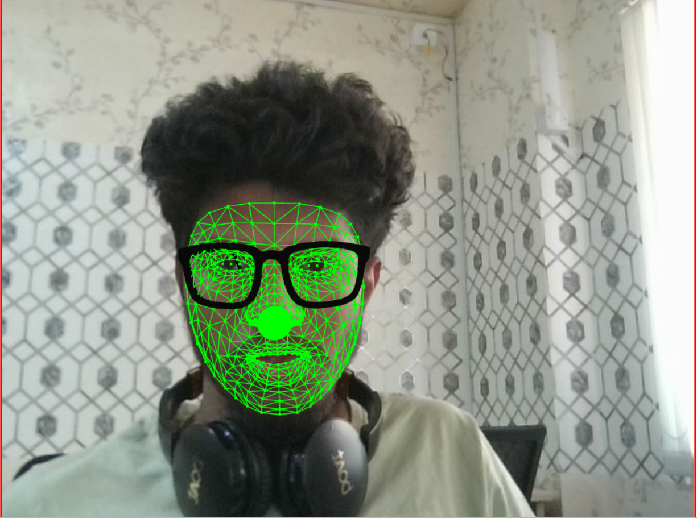

# mediapipe-facelandmarker-threejs
Demontration of mediapipe facelandmarker with three.js

1. Drawing a facemesh using threejs
2. Spawning an object with the help of threejs
3. Accessible through network connected devices

Note: Models and code reference has been taken from the below repo
https://github.com/breathingcyborg/mediapipe-face-effects

Realtime facemesh effects using mediapipe and Three JS.
